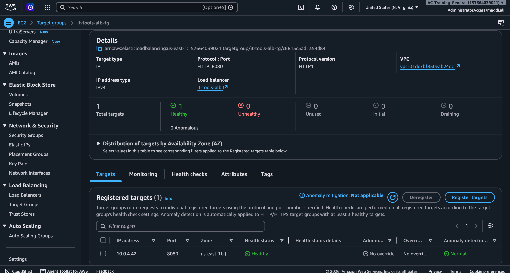
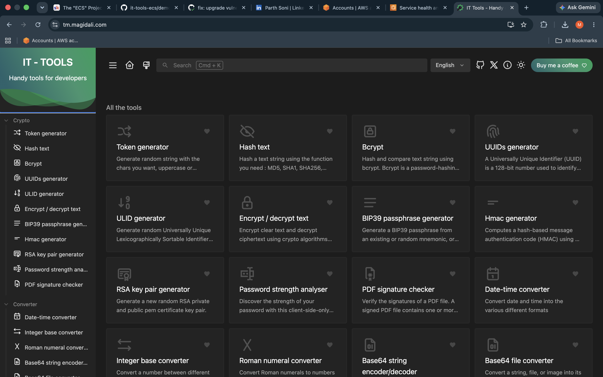

# IT-Tools on AWS ECS

A production-style DevOps project that deploys **IT-Tools** to **AWS ECS Fargate** using Docker, Terraform, GitHub Actions, Route 53, ACM, and Amazon ECR.

The project covers the full deployment lifecycle: **build → test → scan → provision → deploy → validate → destroy**.

## Architecture


### Application Flow

`User → Route 53 → HTTPS ALB → ECS Fargate → NGINX → IT-Tools`

### Deployment Flow

`GitHub → GitHub Actions → AWS OIDC → Docker/ECR → Terraform → ECS Fargate`

## Live Demo


The demo shows the application loading through the custom HTTPS domain, basic application functionality, and the `/health` endpoint.

## What I Built

- Containerized IT-Tools using a multi-stage Docker build
- Deployed the application to AWS ECS Fargate
- Placed ECS tasks inside private subnets
- Exposed the application through an Application Load Balancer
- Configured HTTP → HTTPS redirection
- Added HTTPS using AWS ACM
- Connected a custom domain through Route 53
- Provisioned infrastructure using modular Terraform
- Stored Docker images in Amazon ECR
- Tagged Docker images using the Git commit SHA
- Used GitHub Actions OIDC authentication instead of long-lived AWS credentials
- Added pre-deployment container health testing
- Added Trivy image scanning
- Added Terraform validation using TFLint and Checkov
- Added post-deployment health verification
- Added an automated destroy workflow for runtime infrastructure

## CI/CD

### Pull Requests

Pull requests targeting `main` run:

```text
terraform fmt
terraform validate
TFLint
terraform plan
```

### Deployment

Merging to `main` triggers:

```text
Build Docker Image
        ↓
Run Container
        ↓
Test /health
        ↓
Trivy Scan
        ↓
Push SHA-Tagged Image to ECR
        ↓
Terraform Plan
        ↓
Terraform Apply
        ↓
Deploy to ECS Fargate
        ↓
Verify Live /health Endpoint
```

## AWS Infrastructure

```text
VPC
├── 2 Public Subnets
│   ├── Application Load Balancer
│   └── NAT Gateway
│
└── 2 Private Subnets
    └── ECS Fargate Task
```

The ECS service has **no public IP** and accepts application traffic only from the ALB security group on port `8080`.

## Security

- GitHub Actions authenticates to AWS using OIDC
- No long-lived AWS access keys stored in GitHub
- ECS tasks run inside private subnets
- HTTPS provided through ACM
- ECR image scanning enabled
- ECR image tags are immutable
- Docker images scanned with Trivy
- ECS is accessible only through the ALB
- Terraform checked with TFLint and Checkov

## Screenshots

### Successful Deployment


### ECS Service


### Healthy Target Group



### Live Application



### Infrastructure Destroy


## Tech Stack

**AWS:** ECS Fargate, ECR, ALB, Route 53, ACM, VPC, IAM, CloudWatch, S3

**DevOps:** Terraform, Docker, GitHub Actions, Trivy, Checkov, TFLint

**Application:** IT-Tools, NGINX

## Repository Structure

```text
.
├── app/
├── infra/
│   ├── bootstrap/
│   └── modules/
├── .github/
│   └── workflows/
├── docs/
│   └── screenshots/
├── Dockerfile
├── nginx.conf
└── README.md
```

## Infrastructure Lifecycle

```text
Provision → Deploy → Validate → Destroy
```

The runtime infrastructure can be destroyed through GitHub Actions after testing and documentation are complete, helping prevent unnecessary AWS costs.

---

**Magdi Ali**  
DevOps Engineer