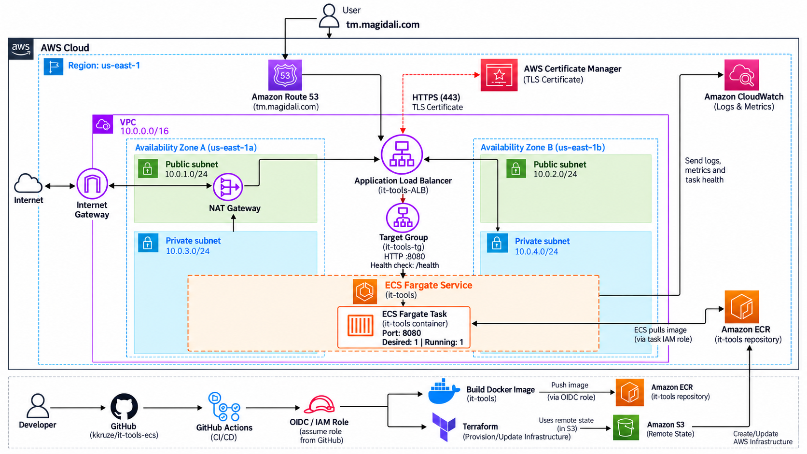
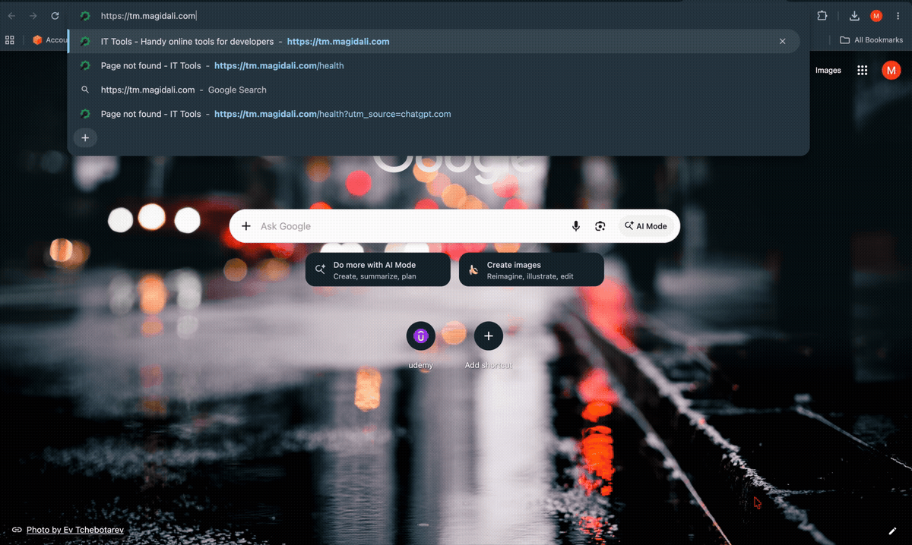
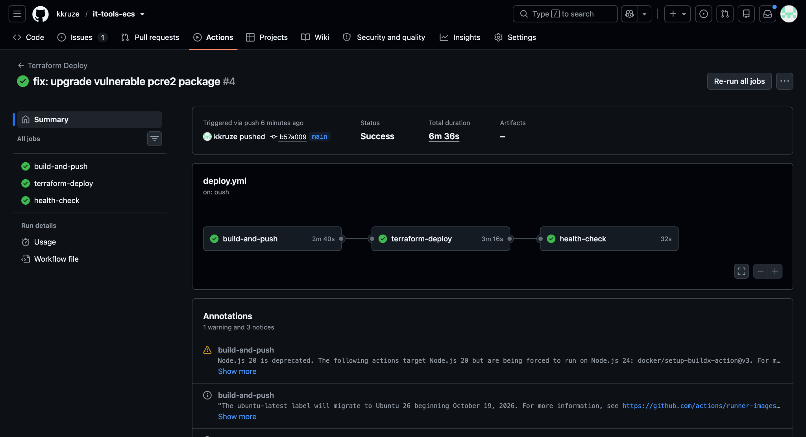
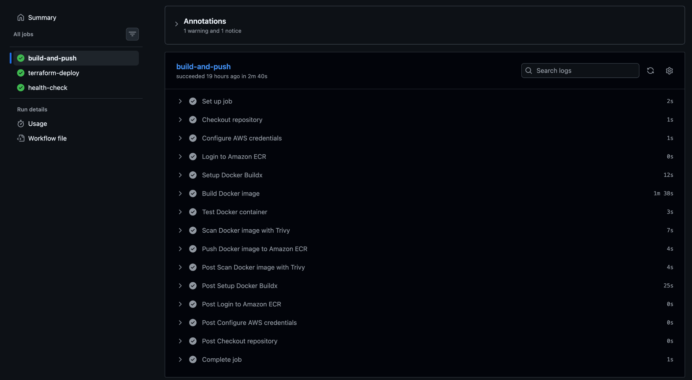
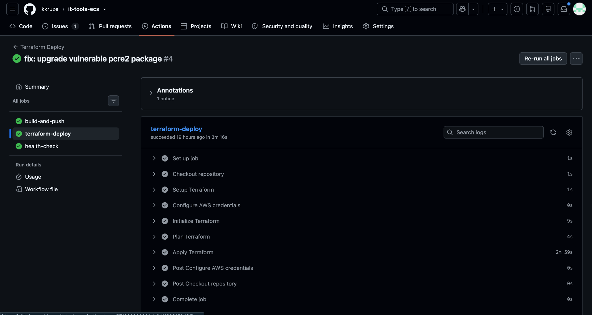
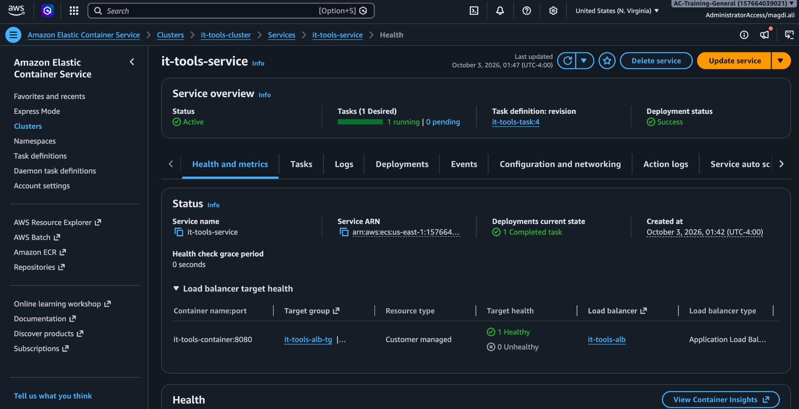
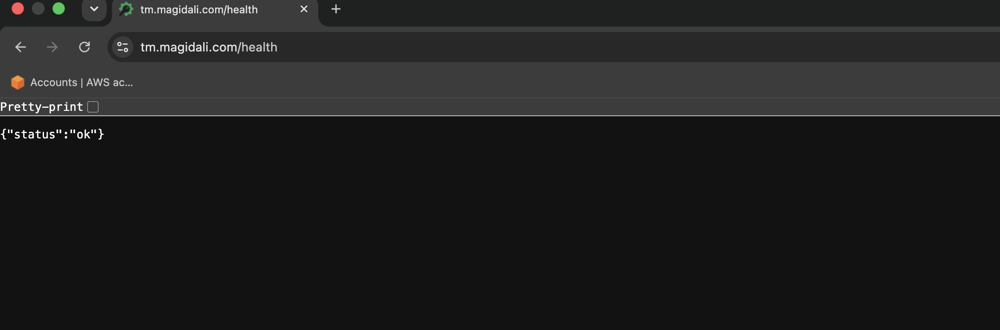
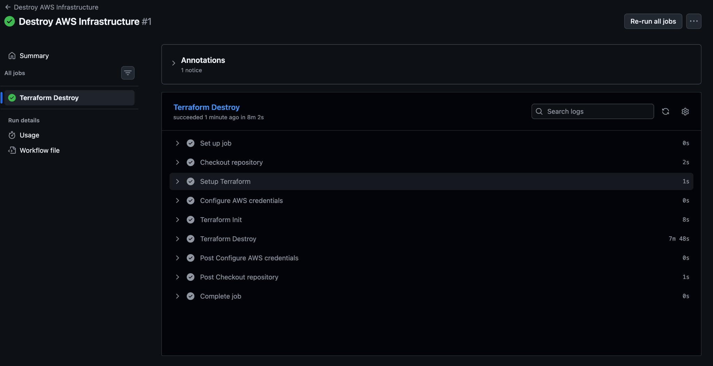

# IT-Tools on AWS ECS

A production-style DevOps project that deploys **IT-Tools** to **AWS ECS Fargate** using Docker, Terraform, GitHub Actions, Route 53, ACM, and Amazon ECR.

The project demonstrates a complete infrastructure and deployment lifecycle:

**build → test → scan → provision → deploy → validate → destroy**

## Architecture



### Application Flow

`User → Route 53 → HTTPS ALB → Target Group → ECS Fargate → NGINX → IT-Tools`

### Deployment Flow

`GitHub → GitHub Actions → AWS OIDC / IAM → Docker → ECR → Terraform → ECS Fargate`

## Live Demo



The demo shows the application running through the custom HTTPS domain and responding normally during live use.

## What I Built

- Containerized IT-Tools using a multi-stage Docker build
- Built production images for `linux/amd64`
- Deployed the application to AWS ECS Fargate
- Placed ECS tasks inside private subnets with no public IP
- Exposed the application through an Application Load Balancer
- Configured HTTP to HTTPS redirection
- Added TLS using AWS Certificate Manager
- Connected `tm.magidali.com` through Route 53
- Provisioned AWS infrastructure using modular Terraform
- Stored Docker images in Amazon ECR
- Tagged Docker images using the Git commit SHA
- Used GitHub Actions OIDC authentication instead of long-lived AWS credentials
- Added pre-deployment container health testing
- Added Trivy vulnerability scanning
- Added Terraform validation with TFLint and Checkov
- Added post-deployment `/health` verification
- Used Amazon S3 for remote Terraform state
- Added a manually triggered Terraform destroy workflow for runtime infrastructure

## CI/CD

### Pull Request Validation

Pull requests targeting `main` run:

```text
terraform fmt
        ↓
terraform validate
        ↓
TFLint
        ↓
terraform plan
```

### Deployment Pipeline

A push to `main` triggers:

```text
Build Docker Image
        ↓
Run Container
        ↓
Test /health
        ↓
Trivy Security Scan
        ↓
Push SHA-Tagged Image to ECR
        ↓
Terraform Plan
        ↓
Terraform Apply
        ↓
Deploy to ECS Fargate
        ↓
Verify Live /health Endpoint
```

### Successful Deployment Workflow

The complete GitHub Actions deployment completed successfully across the build, infrastructure deployment, and post-deployment health-check stages.



### Build, Test, Scan & Push

The build stage authenticates to AWS through OIDC, builds the production Docker image, starts the container for validation, checks `/health`, scans the image with Trivy, and pushes the SHA-tagged image to Amazon ECR.



### Terraform Deployment

After the container image is published, Terraform initializes the remote state, generates a deployment plan, applies the infrastructure changes, and deploys the updated task revision to ECS Fargate.



### Infrastructure Destroy

Runtime infrastructure can be removed through a manually triggered GitHub Actions workflow:

```text
GitHub Actions
        ↓
AWS OIDC Authentication
        ↓
Terraform Init
        ↓
Terraform Destroy
        ↓
Runtime Infrastructure Removed
```

## AWS Infrastructure

```text
AWS
│
├── Route 53
│   └── tm.magidali.com
│
├── ACM
│   └── TLS Certificate
│
├── VPC
│   ├── Public Subnet A
│   │   ├── Application Load Balancer
│   │   └── NAT Gateway
│   │
│   ├── Public Subnet B
│   │   └── Application Load Balancer
│   │
│   ├── Private Subnet A
│   │   └── ECS Fargate
│   │
│   └── Private Subnet B
│       └── ECS Fargate
│
├── ECR
│   └── Docker Images
│
├── CloudWatch
│   └── ECS Logs
│
└── S3
    └── Terraform Remote State
```

The Application Load Balancer spans two public subnets across separate Availability Zones.

The ECS service runs inside private subnets with **no public IP** and accepts application traffic only from the ALB security group on port `8080`.

A single NAT Gateway provides outbound connectivity for the private subnets while keeping the architecture cost-conscious.

## Security

- GitHub Actions authenticates to AWS using OIDC
- No long-lived AWS access keys are stored in GitHub
- ECS tasks run inside private subnets
- ECS tasks have no public IP
- HTTPS is provided through AWS ACM
- HTTP traffic is redirected to HTTPS
- ECS accepts application traffic only from the ALB security group
- Docker images are scanned with Trivy before deployment
- ECR image tags are configured as immutable
- Terraform is checked using TFLint and Checkov
- Application health is verified before and after deployment

## Challenges & Solutions

### Docker Architecture Mismatch

The Docker image was initially built on Apple Silicon, which caused an architecture mismatch when deploying to ECS.

**Solution:** Built the production image explicitly for `linux/amd64` using Docker Buildx.

### ALB Health Check Failures

The target group initially failed health checks because the application did not expose the expected `/health` endpoint correctly.

**Solution:** Added a dedicated NGINX `/health` route returning `200 OK` and configured the ALB target group to use that endpoint.

### Container Vulnerability Detected in CI

Trivy blocked deployment after detecting a HIGH severity vulnerability in the Alpine `pcre2` package.

**Solution:** Updated the vulnerable package during the Docker build, rebuilt the image, and verified that the Trivy security scan passed before deployment continued.

### Secure GitHub-to-AWS Authentication

The CI/CD pipeline required AWS access without storing permanent AWS credentials in GitHub.

**Solution:** Configured GitHub Actions to assume an AWS IAM role through GitHub OIDC.

### Infrastructure Cost Management

Cloud infrastructure such as NAT Gateways and Application Load Balancers can continue generating charges when left running.

**Solution:** Added a manually triggered Terraform destroy workflow and verified the runtime infrastructure was removed after project validation.

## Deployment Evidence

### ECS Service

The deployed ECS service reached the desired running state successfully.



### Application Health Endpoint

The public HTTPS health endpoint returned a successful response.



### Infrastructure Destroy

The Terraform destroy workflow successfully removed the runtime AWS infrastructure after testing and documentation were completed.



## Repository Structure

```text
.
├── .github/
│   └── workflows/
│       ├── deploy.yml
│       ├── destroy.yml
│       └── plan.yml
│
├── app/
│
├── docs/
│   └── screenshots/
│
├── infra/
│   ├── bootstrap/
│   │   └── Terraform bootstrap configuration
│   │
│   ├── modules/
│   │   ├── acm/
│   │   ├── alb/
│   │   ├── ecr/
│   │   ├── ecs/
│   │   ├── security/
│   │   └── vpc/
│   │
│   └── Terraform root configuration
│
├── Dockerfile
├── nginx.conf
└── README.md
```

### Terraform Modules

| Module | Purpose |
|---|---|
| `acm` | TLS certificate creation and DNS validation |
| `alb` | Application Load Balancer, listeners, target group, and health checks |
| `ecr` | Amazon ECR repository for Docker images |
| `ecs` | ECS cluster, task definition, service, IAM execution role, and logging |
| `security` | ALB and ECS security groups and traffic rules |
| `vpc` | VPC, public/private subnets, Internet Gateway, NAT Gateway, and routing |

## Tech Stack

**AWS:** ECS Fargate, ECR, Application Load Balancer, Route 53, ACM, VPC, IAM, CloudWatch, S3

**Infrastructure:** Terraform

**CI/CD:** GitHub Actions, GitHub OIDC

**Containers:** Docker, Docker Buildx, NGINX

**Security & Validation:** Trivy, Checkov, TFLint

**Application:** IT-Tools

## Infrastructure Lifecycle

```text
Provision
    ↓
Deploy
    ↓
Validate
    ↓
Destroy
```

The runtime AWS infrastructure can be recreated through Terraform and removed through the GitHub Actions destroy workflow after testing, helping prevent unnecessary cloud costs.

---

**Magdi Ali**  
DevOps Engineer